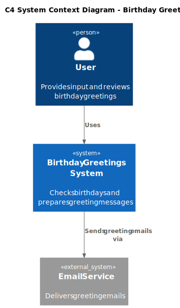

# 3. System Scope and Context

## 3.1 Business Context

The Birthday Greetings system sits between a local contact database and an external email service. The operator triggers it daily (via cron or manually). The system has no user-facing interface.

| Neighbour | Communication | Direction |
|-----------|---------------|-----------|
| Operator / Scheduler | Triggers the process once per day | → System |
| SQLite Database | Provides contact records (name, email, date of birth) | → System |
| External Email Service | Receives send requests and delivers emails to recipients | System → |
| Contact (Birthday Person) | Receives the greeting email | System → |

## 3.2 Technical Context

The application is a Python script executed by the OS scheduler. It reads from a local SQLite file and calls an external SMTP or API-based email service over the network.

## 3.3 C4 System Context Diagram

